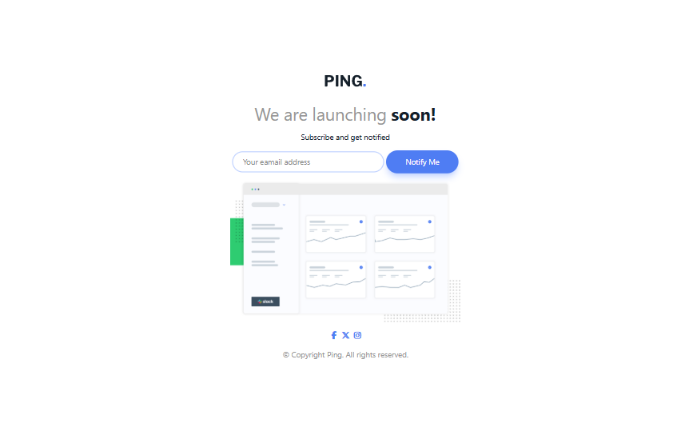

# Frontend Mentor - Ping coming soon page solution

This is a solution to the [Ping coming soon page challenge on Frontend Mentor](https://www.frontendmentor.io/challenges/ping-single-column-coming-soon-page-5cadd051fec04111f7b848da). Frontend Mentor challenges help you improve your coding skills by building realistic projects.

## Table of contents

- [The challenge](#the-challenge)
- [Screenshot](#screenshot)
- [Links](#links)
- [Built with](#built-with)
- [What I learned](#what-i-learned)
- [Continued development](#continued-development)
- [Author](#author)
- [Acknowledgments](#acknowledgments)

### The challenge

Users should be able to:

- View the optimal layout for the site depending on their device's screen size
- See hover states for all interactive elements on the page
- Submit their email address using an `input` field
- Receive an error message when the `form` is submitted if:
  - The `input` field is empty. The message for this error should say _"Whoops! It looks like you forgot to add your email"_
  - The email address is not formatted correctly (i.e. a correct email address should have this structure: `name@host.tld`). The message for this error should say _"Please provide a valid email address"_

### Screenshot



### Links

<!-- - Solution URL: [Add solution URL here](https://your-solution-url.com) -->

- [live site URL here](https://jeanclaude09-dev.github.io/ping-coming-soon-page/)

### Built with

- Semantic HTML5 markup
- CSS custom properties
- Flexbox
- CSS Grid
- JavaScript

### What I learned

- Using `.value.trim()` deletes white spaces
- test() check if a string contain a match
- `e.preventDefault();` prevent for submitting by default action that normally associated with an event

### Continued development

- I would like to know more about:

```js
.addEventListener("", (e) => {
  // instruction
})
```

When to use it, how to use it, and what it really means

## Author

- Frontend Mentor - [@jeanclaude09-dev](https://www.frontendmentor.io/profile/jeanclaude09-dev)
- Twitter - [@iamjeanclaude09](https://www.twitter.com/iamjeanclaude09)
- Github - [@jeanclaude09-dev](https://github.com/Jeanclaude09-dev)
